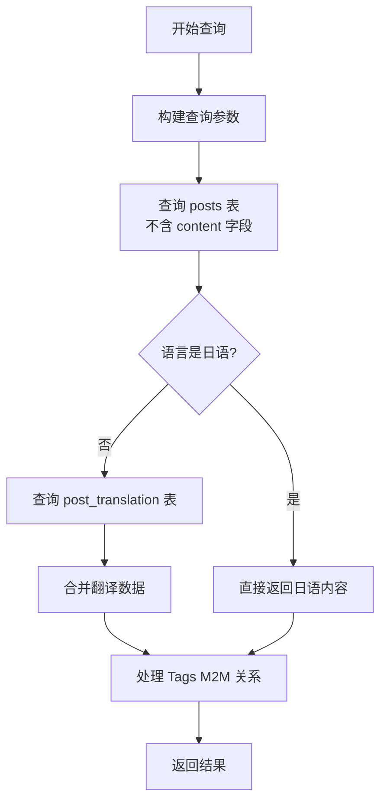
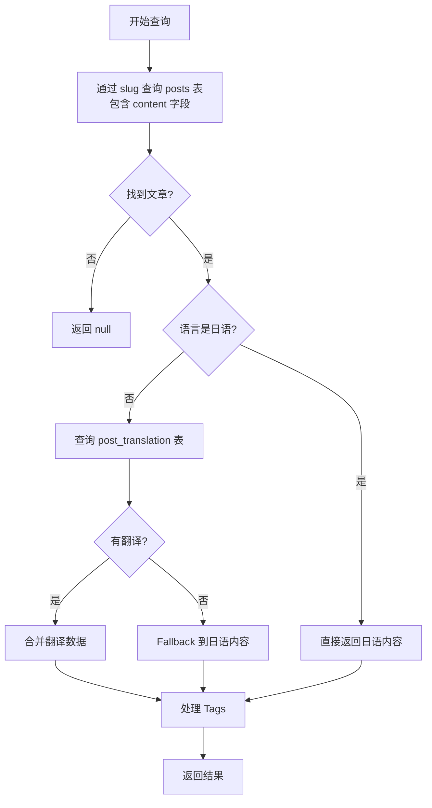
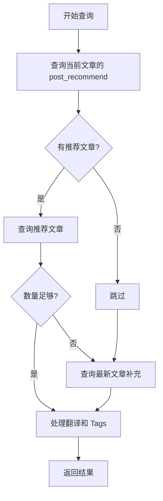
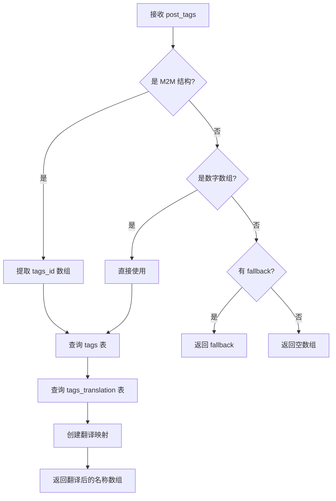

# Directus Blog 查询逻辑文档

**文档版本**: 1.0  
**最后更新**: 2025-01-XX  
**用途**: 标准化接入指南 - 查询逻辑详解

---

## 📋 概述

本文档详细说明 Directus CMS Blog 系统的查询逻辑，包括多语言处理、M2M 关系处理、缓存策略等。用于标准化接入，确保新网站使用相同的查询模式。

---

## 🔑 核心查询函数

### 1. `getAllPostsFromCMS` - 获取所有文章（列表页）

**用途**: 博客列表页、首页推荐文章等

**函数签名**:
```typescript
async function getAllPostsFromCMS(
  locale: string,
  page?: number,
  limit?: number,
  siteId: number = SITE_ID
): Promise<BlogPost[]>
```

#### 查询流程



#### 查询步骤详解

**Step 1: 查询 posts 主表（不含 content）**

```typescript
const postsQuery = {
  fields: [
    'id',
    'slug',
    'title',
    'description',
    'published_at',
    'post_tags',  // M2M 关系
    'tags',       // Fallback
    'image',
  ],
  filter: {
    status: { _eq: 'published' },
    ...(siteId ? { site_id: { _eq: siteId } } : {}),
  },
  sort: ['-published_at'],
  // 可选分页
  ...(page && limit ? { limit, page } : {})
}

const posts = await directus.request(readItems('posts', postsQuery))
```

**Step 2: 处理日语内容（locale === 'ja'）**

```typescript
if (locale === 'ja') {
  return Promise.all(
    posts.map(async (post) => {
      const tags = await getTranslatedTags(post.post_tags, locale, post.tags)
      const tagDetails = await getTagDetails(post.post_tags, locale, post.tags)
      return {
        slug: post.slug,
        title: post.title,
        description: post.description,
        content: '', // 列表页不包含内容
        date: post.published_at,
        author: 'JSON きれい Team',
        tags,
        tagDetails,
        readingTime: Math.ceil(post.description.split(/\s+/).length / 50),
        locale: 'ja' as const,
      }
    })
  )
}
```

**Step 3: 处理其他语言（en/zh/es）**

```typescript
// 查询翻译表
const postIds = posts.map((p) => p.id)
const translations = await directus.request(
  readItems('post_translation', {
    fields: ['post_id', 'language_code', 'title', 'description'],
    filter: {
      post_id: { _in: postIds },
      language_code: { _eq: locale },
    },
  })
)

// 创建翻译映射
const translationMap = new Map(
  translations.map((t) => [t.post_id, t])
)

// 只返回有翻译的文章
const translatedPosts = posts.filter((post) => translationMap.has(post.id))

// 合并数据
return Promise.all(
  translatedPosts.map(async (post) => {
    const translation = translationMap.get(post.id)!
    const tags = await getTranslatedTags(post.post_tags, locale, post.tags)
    const tagDetails = await getTagDetails(post.post_tags, locale, post.tags)
    
    return {
      slug: post.slug,
      title: translation.title,
      description: translation.description,
      content: '', // 列表页不包含内容
      date: post.published_at,
      author: 'JSON きれい Team',
      tags,
      tagDetails,
      readingTime: Math.ceil(translation.description.split(/\s+/).length / 50),
      locale: locale as 'en' | 'zh',
    }
  })
)
```

#### 缓存策略

```typescript
const cached = unstable_cache(
  (loc: string, sid: number, pg?: number, lm?: number) =>
    getAllPostsFromCMSInternal(loc, sid, pg, lm),
  ['blog-posts', locale, String(siteId), String(page ?? ''), String(limit ?? '')],
  {
    revalidate: 86400, // 24 小时
    tags: ['posts', `posts:${locale}`, `posts:${locale}:${siteId}`],
  }
)
```

---

### 2. `getPostBySlugFromCMS` - 获取单篇文章（详情页）

**用途**: 文章详情页

**函数签名**:
```typescript
async function getPostBySlugFromCMS(
  slug: string,
  locale: string,
  siteId: number = SITE_ID
): Promise<BlogPost | null>
```

#### 查询流程



#### 查询步骤详解

**Step 1: 查询 posts 主表（含 content）**

```typescript
const posts = await directus.request(
  readItems('posts', {
    fields: [
      'id',
      'slug',
      'title',
      'description',
      'content',  // 详情页包含完整内容
      'published_at',
      'post_tags',
      'post_recommend',
      'tags',
      'image',
    ],
    filter: {
      slug: { _eq: slug },
      ...(siteId ? { site_id: { _eq: siteId } } : {}),
      status: { _eq: 'published' },
    },
    limit: 1,
  })
)

if (posts.length === 0) {
  return null
}

const post = posts[0]
```

**Step 2: 处理日语内容**

```typescript
if (locale === 'ja') {
  const faq = extractFAQFromContent(post.content)
  const tags = await getTranslatedTags(post.post_tags, locale, post.tags)
  const tagDetails = await getTagDetails(post.post_tags, locale, post.tags)
  
  return {
    slug: post.slug,
    title: post.title,
    description: post.description,
    content: post.content,
    date: post.published_at,
    author: 'JSON きれい Team',
    tags,
    tagDetails,
    readingTime: calculateReadingTime(post.content),
    locale: 'ja' as const,
    faq: faq.length > 0 ? faq : undefined
  }
}
```

**Step 3: 处理其他语言**

```typescript
// 查询翻译
const translations = await directus.request(
  readItems('post_translation', {
    fields: ['post_id', 'language_code', 'title', 'description', 'content'],
    filter: {
      post_id: { _eq: post.id },
      language_code: { _eq: locale },
    },
    limit: 1,
  })
)

const translation = translations.length > 0 ? translations[0] : null

// 合并数据（使用 mergePostWithTranslation 函数）
return await mergePostWithTranslation(post, translation, locale)
```

#### 缓存策略

```typescript
const cached = unstable_cache(
  (sg: string, loc: string, sid: number) =>
    getPostBySlugFromCMSInternal(sg, loc, sid),
  ['blog-post-detail', slug, locale, String(siteId)],
  {
    revalidate: 86400, // 24 小时
    tags: ['posts', `post:${slug}`, `post:${slug}:${locale}`],
  }
)
```

---

### 3. `getRelatedPostsFromCMS` - 获取推荐文章

**用途**: 文章详情页的推荐文章

**函数签名**:
```typescript
async function getRelatedPostsFromCMS(
  currentSlug: string,
  locale: string,
  siteId: number = SITE_ID,
  limit: number = 6
): Promise<BlogPost[]>
```

#### 查询流程



#### 查询步骤详解

**Step 1: 获取当前文章的推荐列表**

```typescript
const currentPosts = await directus.request(
  readItems('posts', {
    fields: ['id', 'post_recommend'],
    filter: {
      slug: { _eq: currentSlug },
      status: { _eq: 'published' },
      ...(siteId ? { site_id: { _eq: siteId } } : {}),
    },
    limit: 1,
  })
)

// 提取 M2M 关系中的 IDs
let recommendedPostIds: string[] = []
if (currentPosts.length > 0 && currentPosts[0].post_recommend) {
  const postRecommend = currentPosts[0].post_recommend as any
  if (Array.isArray(postRecommend)) {
    recommendedPostIds = postRecommend
      .map((item: any) => item.related_posts_id)
      .filter((id: any) => typeof id === 'string')
  }
}
```

**Step 2: 查询推荐文章**

```typescript
let recommendedPosts: any[] = []
if (recommendedPostIds.length > 0) {
  recommendedPosts = await directus.request(
    readItems('posts', {
      fields: ['id', 'slug', 'title', 'description', 'published_at', 'post_tags', 'tags', 'image'],
      filter: {
        id: { _in: recommendedPostIds },
        status: { _eq: 'published' },
        ...(siteId ? { site_id: { _eq: siteId } } : {}),
      },
    })
  )
}
```

**Step 3: 补充最新文章（如果推荐不够）**

```typescript
let additionalPosts: any[] = []
if (recommendedPosts.length < limit) {
  const excludeIds = recommendedPosts.map((p: any) => p.id)
  additionalPosts = await directus.request(
    readItems('posts', {
      fields: ['id', 'slug', 'title', 'description', 'published_at', 'post_tags', 'tags', 'image'],
      filter: {
        slug: { _neq: currentSlug },
        ...(excludeIds.length > 0 ? { id: { _nin: excludeIds } } : {}),
        status: { _eq: 'published' },
        ...(siteId ? { site_id: { _eq: siteId } } : {}),
      },
      sort: ['-published_at'],
      limit: Math.max((limit - recommendedPosts.length) * 5, 50), // 扩大池子以应对翻译过滤
    })
  )
}

const allPosts = [...recommendedPosts, ...additionalPosts]
```

**Step 4: 处理翻译和 Tags**

```typescript
// 日语直接返回
if (locale === 'ja') {
  // ... 处理逻辑
}

// 其他语言查询翻译
const postIds = allPosts.map((p: any) => p.id)
const translations = await directus.request(
  readItems('post_translation', {
    fields: ['post_id', 'language_code', 'title', 'description'],
    filter: {
      post_id: { _in: postIds },
      language_code: { _eq: locale },
    },
  })
)

const translationMap = new Map(translations.map((t) => [t.post_id, t]))
const translated = allPosts
  .filter((post: any) => translationMap.has(post.id))
  .slice(0, limit)

// 合并数据并返回
```

#### 缓存策略

```typescript
const cached = unstable_cache(
  (slug: string, loc: string, sid: number, lm: number) =>
    getRelatedPostsFromCMSInternal(slug, loc, sid, lm),
  ['related-posts', currentSlug, locale, String(siteId), String(limit)],
  {
    revalidate: 43200, // 12 小时
    tags: ['related', `related:${currentSlug}`, `related:${currentSlug}:${locale}`],
  }
)
```

---

### 4. `getPostDetailDataFromCMS` - 合并查询（优化版）

**用途**: 文章详情页（合并文章 + 推荐文章，减少 API 调用）

**函数签名**:
```typescript
async function getPostDetailDataFromCMS(
  slug: string,
  locale: string,
  siteId: number = SITE_ID,
): Promise<PostDetailData>
```

**接口定义**:
```typescript
export interface PostDetailData {
  post: BlogPost | null
  relatedPosts: BlogPost[]
}
```

#### 优化说明

**旧方式** (3 个独立查询):
```typescript
// generateMetadata 中
const post = await getPostBySlugFromCMS(slug, locale)

// page 函数中
const post = await getPostBySlugFromCMS(slug, locale)  // 重复查询！
const relatedPosts = await getRelatedPostsFromCMS(slug, locale)
```

**新方式** (2 个并行查询):
```typescript
// 在 page 和 metadata 中共享
const { post, relatedPosts } = await getPostDetailDataFromCMS(slug, locale)
```

#### 实现逻辑

```typescript
async function getPostDetailDataInternal(
  slug: string,
  locale: string,
  siteId: number = SITE_ID,
): Promise<PostDetailData> {
  // 并行查询
  const [post, relatedPosts] = await Promise.all([
    getPostBySlugFromCMSInternal(slug, locale, siteId),
    getRelatedPostsFromCMSInternal(slug, locale, siteId, 6),
  ])

  return {
    post,
    relatedPosts,
  }
}
```

**优势**:
- ✅ 消除重复查询（Page + Metadata 共享）
- ✅ 并行执行，减少总延迟
- ✅ 统一缓存策略

---

## 🏷️ Tags 查询逻辑

### `getTranslatedTags` - 获取翻译后的标签名称

**用途**: 将 M2M 关系中的 tag IDs 转换为当前语言的标签名称数组

**函数签名**:
```typescript
async function getTranslatedTags(
  postTags: any[] | number[] | null | undefined,
  locale: string,
  fallbackTagsArray?: string[]
): Promise<string[]>
```

#### 处理流程



#### 实现逻辑

```typescript
async function getTranslatedTags(
  postTags: any[] | number[] | null | undefined,
  locale: string,
  fallbackTagsArray?: string[]
): Promise<string[]> {
  // Step 1: 提取 tag IDs
  let tagIds: number[] = []
  
  if (postTags && Array.isArray(postTags)) {
    // M2M 结构: [{ tags_id: 25 }, { tags_id: 26 }]
    if (postTags.length > 0 && typeof postTags[0] === 'object' && 'tags_id' in postTags[0]) {
      tagIds = postTags
        .map(item => item.tags_id)
        .filter(id => typeof id === 'number')
    } 
    // 直接 ID 数组: [25, 26]
    else if (postTags.length > 0 && typeof postTags[0] === 'number') {
      tagIds = postTags as number[]
    }
  }

  // Fallback
  if (tagIds.length === 0 && fallbackTagsArray && fallbackTagsArray.length > 0) {
    return fallbackTagsArray
  }

  if (tagIds.length === 0) {
    return []
  }

  // Step 2: 查询 tags 主表
  const tags = await directus.request(
    readItems('tags', {
      fields: ['id', 'name', 'slug'],
      filter: { id: { _in: tagIds } },
    })
  )

  if (tags.length === 0) {
    return fallbackTagsArray || []
  }

  // Step 3: 查询翻译表
  const translations = await directus.request(
    readItems('tags_translation', {
      fields: ['tag_id', 'language_code', 'translated_name'],
      filter: {
        tag_id: { _in: tagIds },
        language_code: { _eq: locale as any },
      },
    })
  )

  // Step 4: 创建映射并返回
  const translationMap = new Map(
    translations.map((t) => [t.tag_id, t.translated_name])
  )

  return tags.map((tag) => translationMap.get(tag.id) || tag.name)
}
```

---

## 🔄 多语言处理策略

### 语言优先级

1. **日语 (ja)**: 直接从 `posts` 主表读取
2. **其他语言 (en/zh/es)**: 
   - 优先从 `post_translation` 读取
   - 如果没有翻译，fallback 到日语内容

### 翻译合并逻辑

```typescript
async function mergePostWithTranslation(
  post: DirectusPost,
  translation: PostTranslation | null,
  locale: string
): Promise<BlogPost> {
  const tags = await getTranslatedTags(post.post_tags, locale, post.tags)
  const tagDetails = await getTagDetails(post.post_tags, locale, post.tags)

  // 日语：直接使用主表数据
  if (locale === 'ja') {
    return {
      slug: post.slug,
      title: post.title,
      description: post.description,
      content: post.content,
      // ... 其他字段
    }
  }

  // 其他语言：优先使用翻译，否则 fallback
  if (translation) {
    return {
      slug: post.slug,
      title: translation.title,
      description: translation.description,
      content: translation.content,
      // ... 其他字段
    }
  }

  // Fallback 到日语
  return {
    slug: post.slug,
    title: post.title,
    description: post.description,
    content: post.content,
    // ... 其他字段
  }
}
```

---

## 💾 缓存策略

### 缓存层级

1. **Next.js unstable_cache**: 服务端缓存
2. **Cache Tags**: 支持按需重新验证
3. **ISR (Incremental Static Regeneration)**: 页面级缓存

### 缓存时间

| 查询类型 | 缓存时间 | 说明 |
|---------|---------|------|
| `getAllPostsFromCMS` | 24 小时 | 列表页数据变化不频繁 |
| `getPostBySlugFromCMS` | 24 小时 | 文章内容相对稳定 |
| `getRelatedPostsFromCMS` | 12 小时 | 推荐文章可能变化 |
| `getAllTagsFromCMS` | 24 小时 | 标签列表变化不频繁 |
| `getPostsByTagFromCMS` | 12 小时 | 标签页文章可能变化 |

### 缓存标签

```typescript
// 文章列表
tags: ['posts', `posts:${locale}`, `posts:${locale}:${siteId}`]

// 文章详情
tags: ['posts', `post:${slug}`, `post:${slug}:${locale}`]

// 推荐文章
tags: ['related', `related:${slug}`, `related:${slug}:${locale}`]

// 标签相关
tags: ['tags', `tag:${tagSlug}`, `tag:${tagSlug}:${locale}`]
```

### 缓存清除

通过 API 路由清除缓存：

```typescript
// app/api/revalidate/route.ts
export async function POST(request: Request) {
  const { slug, tag } = await request.json()
  
  if (slug) {
    revalidateTag(`post:${slug}`)
    revalidateTag(`post-detail:${slug}`)
    revalidateTag(`related:${slug}`)
  }
  
  if (tag) {
    revalidateTag(`tag:${tag}`)
  }
  
  // 清除所有文章缓存
  revalidateTag('posts')
}
```

---

## ⚠️ 重要注意事项

### 1. M2M 关系处理

**正确方式**:
```typescript
// M2M 返回结构
post_tags: [{ tags_id: 25 }, { tags_id: 26 }]

// 提取 IDs
const tagIds = postTags
  .map(item => item.tags_id)
  .filter(id => typeof id === 'number')
```

**错误方式**:
```typescript
// ❌ 不要假设是简单数组
const tagIds = postTags as number[]  // 可能出错
```

### 2. 站点隔离

所有查询必须包含 `site_id` 过滤：

```typescript
filter: {
  status: { _eq: 'published' },
  ...(siteId ? { site_id: { _eq: siteId } } : {}),
}
```

### 3. 字段选择优化

- **列表页**: 不查询 `content` 字段（减少 90%+ 数据传输）
- **详情页**: 查询完整 `content` 字段

### 4. 翻译过滤

非日语语言只返回有翻译的文章：

```typescript
const translatedPosts = posts.filter((post) => translationMap.has(post.id))
```

---

## 📚 相关文档

- [Directus Blog 表结构文档](./DIRECTUS_BLOG_SCHEMA.md)
- [Tags 系统完整文档](./DIRECTUS_BLOG_TAGS.md)
- [优化方案文档](./DIRECTUS_BLOG_OPTIMIZATION.md)
- [标准化接入指南](./DIRECTUS_BLOG_INTEGRATION.md)

---

**文档维护**: 本文档应与代码实现保持同步。如有变更，请及时更新。

