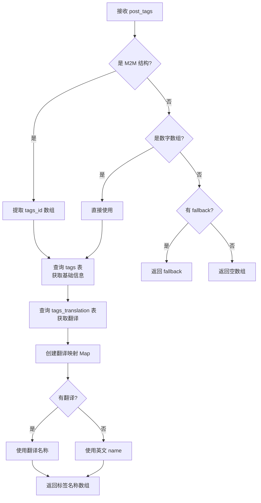
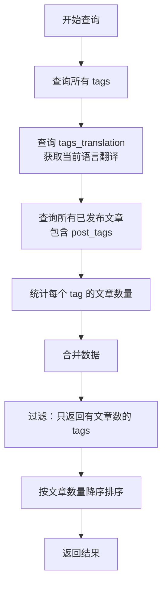
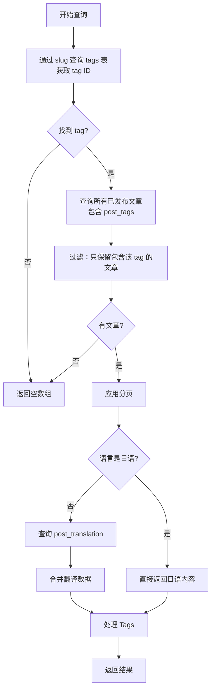

# Directus Blog Tags 系统完整文档

**文档版本**: 1.0  
**最后更新**: 2025-01-XX  
**用途**: 标准化接入指南 - Tags 系统详解

---

## 📋 概述

本文档详细说明 Directus CMS Blog 系统中 Tags（标签）的完整实现，包括表结构、查询逻辑、翻译机制、使用场景等。用于标准化接入，确保新网站使用相同的 Tags 系统。

---

## 🗄️ Tags 表结构

### 1. `tags` - 标签主表

**说明**: 存储标签的基础信息，英文名称作为默认值。

#### 字段定义

| 字段名 | 类型 | 必填 | 说明 | 示例 |
|--------|------|------|------|------|
| `id` | Integer | ✅ | 主键，自增 | `25` |
| `name` | String | ✅ | 标签名称（英文，默认） | `"JSON"` |
| `slug` | String | ✅ | URL 友好标识符，唯一 | `"json"` |

#### 数据示例

```json
{
  "id": 25,
  "name": "JSON",
  "slug": "json"
}
```

---

### 2. `tags_translation` - 标签翻译表

**说明**: 存储标签的多语言翻译，支持 `en`, `ja`, `zh`, `es` 四种语言。

#### 字段定义

| 字段名 | 类型 | 必填 | 说明 | 示例 |
|--------|------|------|------|------|
| `id` | Integer | ✅ | 主键，自增 | `1` |
| `tag_id` | Integer | ✅ | 关联到 `tags.id` | `25` |
| `language_code` | String | ✅ | 语言代码：`en` / `ja` / `zh` / `es` | `"ja"` |
| `translated_name` | String | ✅ | 翻译后的标签名称 | `"JSON"` |

#### 关系说明

- **关系类型**: One-to-Many (O2M)
- **关联**: `tags_translation.tag_id` → `tags.id`
- **唯一约束**: `(tag_id, language_code)` 应该唯一

#### 数据示例

```json
{
  "id": 1,
  "tag_id": 25,
  "language_code": "ja",
  "translated_name": "JSON"
}
```

---

### 3. `posts.post_tags` - M2M 关系字段

**说明**: 文章与标签的多对多关系，通过 Directus M2M 关系实现。

#### M2M 关系结构

```
posts (主表)
  └── post_tags (M2M 关系字段)
      └── post_tags (中间表，自动生成)
          ├── id (Integer)
          ├── posts_id (UUID) → posts.id
          └── tags_id (Integer) → tags.id
```

#### 查询返回格式

```typescript
// 查询 posts 时，post_tags 字段返回：
post_tags: [
  { tags_id: 25 },
  { tags_id: 26 },
  { tags_id: 27 }
]

// ⚠️ 注意：不是简单的数组 [25, 26, 27]
```

---

## 🔍 Tags 查询函数

### 1. `getTranslatedTags` - 获取翻译后的标签名称数组

**用途**: 将 M2M 关系中的 tag IDs 转换为当前语言的标签名称数组

**函数签名**:
```typescript
async function getTranslatedTags(
  postTags: any[] | number[] | null | undefined,
  locale: string,
  fallbackTagsArray?: string[]
): Promise<string[]>
```

#### 参数说明

| 参数 | 类型 | 说明 |
|------|------|------|
| `postTags` | `any[] \| number[] \| null \| undefined` | M2M 关系数组或直接 ID 数组 |
| `locale` | `string` | 语言代码：`en`, `ja`, `zh`, `es` |
| `fallbackTagsArray` | `string[]` (可选) | 旧字段的 fallback 值 |

#### 返回值

```typescript
Promise<string[]>  // 例如: ["JSON", "教程", "基础"]
```

#### 查询流程



#### 实现代码

```typescript
async function getTranslatedTags(
  postTags: any[] | number[] | null | undefined,
  locale: string,
  fallbackTagsArray?: string[]
): Promise<string[]> {
  // Step 1: 提取 tag IDs
  let tagIds: number[] = []
  
  if (postTags && Array.isArray(postTags)) {
    // M2M 结构: [{ tags_id: 25 }, { tags_id: 26 }]
    if (postTags.length > 0 && typeof postTags[0] === 'object' && 'tags_id' in postTags[0]) {
      tagIds = postTags
        .map(item => item.tags_id)
        .filter(id => typeof id === 'number')
    } 
    // 直接 ID 数组: [25, 26]
    else if (postTags.length > 0 && typeof postTags[0] === 'number') {
      tagIds = postTags as number[]
    }
  }

  // Fallback: 如果 post_tags 为空但旧 tags 字段有值
  if (tagIds.length === 0 && fallbackTagsArray && fallbackTagsArray.length > 0) {
    return fallbackTagsArray
  }

  if (tagIds.length === 0) {
    return []
  }

  try {
    // Step 2: 查询 tags 主表
    const tags = await directus.request(
      readItems('tags', {
        fields: ['id', 'name', 'slug'],
        filter: {
          id: { _in: tagIds },
        },
      })
    )

    if (tags.length === 0) {
      return fallbackTagsArray || []
    }

    // Step 3: 查询 tags_translation 表
    const translations = await directus.request(
      readItems('tags_translation', {
        fields: ['tag_id', 'language_code', 'translated_name'],
        filter: {
          tag_id: { _in: tagIds },
          language_code: { _eq: locale as any },
        },
      })
    )

    // Step 4: 创建翻译映射
    const translationMap = new Map(
      translations.map((t) => [t.tag_id, t.translated_name])
    )

    // Step 5: 返回翻译后的名称，fallback 到英文
    return tags.map((tag) => translationMap.get(tag.id) || tag.name)
  } catch (error) {
    console.error('Error fetching tag translations:', error)
    return fallbackTagsArray || []
  }
}
```

#### 使用示例

```typescript
// 在文章查询中使用
const post = await directus.request(readItems('posts', { ... }))
const tags = await getTranslatedTags(post.post_tags, 'ja', post.tags)
// 返回: ["JSON", "教程", "基础"]
```

---

### 2. `getTagDetails` - 获取标签详情（名称 + Slug）

**用途**: 获取标签的完整信息，包括名称和 slug（用于生成链接）

**函数签名**:
```typescript
async function getTagDetails(
  postTags: any[] | number[] | null | undefined,
  locale: string,
  fallbackTagsArray?: string[]
): Promise<TagInfo[]>
```

#### 返回值类型

```typescript
interface TagInfo {
  name: string
  slug: string
}

// 返回: [{ name: "JSON", slug: "json" }, { name: "教程", slug: "jiao-cheng" }]
```

#### 实现逻辑

```typescript
async function getTagDetails(
  postTags: any[] | number[] | null | undefined,
  locale: string,
  fallbackTagsArray?: string[]
): Promise<TagInfo[]> {
  // 提取 tag IDs（与 getTranslatedTags 相同逻辑）
  let tagIds: number[] = []
  // ... 提取逻辑 ...

  // Fallback: 从旧 tags 数组生成 slug
  if (tagIds.length === 0 && fallbackTagsArray && fallbackTagsArray.length > 0) {
    return fallbackTagsArray.map(name => ({
      name,
      slug: generateTagSlug(name)  // 从名称生成 slug
    }))
  }

  // 查询 tags 主表（包含 slug）
  const tags = await directus.request(
    readItems('tags', {
      fields: ['id', 'name', 'slug'],
      filter: { id: { _in: tagIds } },
    })
  )

  // 查询翻译
  const translations = await directus.request(
    readItems('tags_translation', {
      fields: ['tag_id', 'language_code', 'translated_name'],
      filter: {
        tag_id: { _in: tagIds },
        language_code: { _eq: locale as any },
      },
    })
  )

  const translationMap = new Map(
    translations.map((t) => [t.tag_id, t.translated_name])
  )

  // 返回名称（翻译）+ slug（来自主表）
  return tags.map((tag) => ({
    name: translationMap.get(tag.id) || tag.name,
    slug: tag.slug,  // slug 不翻译，使用主表的 slug
  }))
}
```

---

### 3. `getAllTagsFromCMS` - 获取所有标签（带文章数量）

**用途**: 标签云、标签列表页

**函数签名**:
```typescript
async function getAllTagsFromCMS(
  locale: string,
  siteId: number = SITE_ID
): Promise<TagWithCount[]>
```

#### 返回值类型

```typescript
interface TagWithCount {
  id: number
  name: string
  slug: string
  postCount: number
}
```

#### 查询流程



#### 实现代码

```typescript
async function getAllTagsFromCMSInternal(
  locale: string,
  siteId: number = SITE_ID
): Promise<TagWithCount[]> {
  // Step 1: 获取所有 tags
  const tags = await directus.request(
    readItems('tags', {
      fields: ['id', 'name', 'slug'],
      sort: ['name'],
      limit: -1, // 获取所有
    })
  )

  if (tags.length === 0) {
    return []
  }

  const tagIds = tags.map((tag) => tag.id)

  // Step 2: 获取翻译
  const translations = await directus.request(
    readItems('tags_translation', {
      fields: ['tag_id', 'language_code', 'translated_name'],
      filter: {
        tag_id: { _in: tagIds },
        language_code: { _eq: locale as any },
      },
    })
  )

  const translationMap = new Map(
    translations.map((t) => [t.tag_id, t.translated_name])
  )

  // Step 3: 统计每个 tag 的文章数量
  const publishedPosts = await directus.request(
    readItems('posts', {
      fields: ['id', 'post_tags'],
      filter: {
        status: { _eq: 'published' },
        ...(siteId ? { site_id: { _eq: siteId } } : {}),
      },
    })
  )

  const tagPostCounts = new Map<number, number>()
  publishedPosts.forEach((post: any) => {
    if (post.post_tags && Array.isArray(post.post_tags)) {
      post.post_tags.forEach((pt: any) => {
        if (typeof pt.tags_id === 'number') {
          tagPostCounts.set(pt.tags_id, (tagPostCounts.get(pt.tags_id) || 0) + 1)
        }
      })
    }
  })

  // Step 4: 合并数据
  const result: TagWithCount[] = tags
    .map((tag) => ({
      id: tag.id,
      name: translationMap.get(tag.id) || tag.name,
      slug: tag.slug,
      postCount: tagPostCounts.get(tag.id) || 0,
    }))
    .filter((tag) => tag.postCount > 0) // 只返回有文章数的 tags
    .sort((a, b) => b.postCount - a.postCount) // 按文章数量降序

  return result
}
```

#### 缓存策略

```typescript
const cached = unstable_cache(
  (loc: string, sid: number) => getAllTagsFromCMSInternal(loc, sid),
  ['blog-tags', locale, String(siteId)],
  {
    revalidate: 86400, // 24 小时
    tags: ['tags', `tags:${locale}`, `tags:${locale}:${siteId}`],
  }
)
```

---

### 4. `getPostsByTagFromCMS` - 根据标签获取文章

**用途**: 标签页，显示某个标签下的所有文章

**函数签名**:
```typescript
async function getPostsByTagFromCMS(
  tagSlug: string,
  locale: string,
  siteId: number = SITE_ID,
  page?: number,
  limit?: number
): Promise<BlogPost[]>
```

#### 查询流程



#### 实现代码

```typescript
async function getPostsByTagFromCMSInternal(
  tagSlug: string,
  locale: string,
  siteId: number = SITE_ID,
  page?: number,
  limit?: number
): Promise<BlogPost[]> {
  // Step 1: 通过 slug 获取 tag ID
  const tags = await directus.request(
    readItems('tags', {
      fields: ['id'],
      filter: { slug: { _eq: tagSlug } },
      limit: 1,
    })
  )

  if (tags.length === 0) {
    return []
  }

  const tagId = tags[0].id

  // Step 2: 查询所有已发布文章
  const allPosts = await directus.request(
    readItems('posts', {
      fields: [
        'id',
        'slug',
        'title',
        'description',
        'published_at',
        'post_tags',
        'tags',
        'image',
      ],
      filter: {
        status: { _eq: 'published' },
        ...(siteId ? { site_id: { _eq: siteId } } : {}),
      },
      sort: ['-published_at'],
    })
  )

  // Step 3: 过滤包含该 tag 的文章
  const posts = allPosts.filter((post: any) => {
    if (post.post_tags && Array.isArray(post.post_tags)) {
      return post.post_tags.some((pt: any) => pt.tags_id === tagId)
    }
    return false
  })

  if (posts.length === 0) {
    return []
  }

  // Step 4: 应用分页
  const paginatedPosts = (page && limit)
    ? posts.slice((page - 1) * limit, page * limit)
    : posts

  // Step 5: 处理翻译和 Tags（与 getAllPostsFromCMS 相同逻辑）
  // ... 处理逻辑 ...
}
```

---

### 5. `getRelatedTagsFromCMS` - 获取相关标签

**用途**: 标签页的相关标签推荐

**函数签名**:
```typescript
async function getRelatedTagsFromCMS(
  tagSlug: string,
  locale: string,
  siteId: number = SITE_ID
): Promise<TagWithCount[]>
```

#### 查询逻辑

1. 获取当前标签 ID
2. 查询所有包含该标签的文章
3. 统计这些文章中的其他标签
4. 按出现频率排序，返回前 10 个

#### 实现代码

```typescript
async function getRelatedTagsFromCMSInternal(
  tagSlug: string,
  locale: string,
  siteId: number = SITE_ID
): Promise<TagWithCount[]> {
  // Step 1: 获取当前 tag ID
  const tags = await directus.request(
    readItems('tags', {
      fields: ['id'],
      filter: { slug: { _eq: tagSlug } },
      limit: 1,
    })
  )

  if (tags.length === 0) {
    return []
  }

  const currentTagId = tags[0].id

  // Step 2: 查询所有包含该 tag 的文章
  const postsWithTag = await directus.request(
    readItems('posts', {
      fields: ['id', 'post_tags'],
      filter: {
        status: { _eq: 'published' },
        ...(siteId ? { site_id: { _eq: siteId } } : {}),
      },
    })
  )

  // Step 3: 统计其他标签的出现频率
  const tagCounts = new Map<number, number>()
  postsWithTag.forEach((post: any) => {
    if (post.post_tags && Array.isArray(post.post_tags)) {
      const hasCurrentTag = post.post_tags.some((pt: any) => pt.tags_id === currentTagId)
      if (hasCurrentTag) {
        post.post_tags.forEach((pt: any) => {
          if (typeof pt.tags_id === 'number' && pt.tags_id !== currentTagId) {
            tagCounts.set(pt.tags_id, (tagCounts.get(pt.tags_id) || 0) + 1)
          }
        })
      }
    }
  })

  if (tagCounts.size === 0) {
    return []
  }

  const relatedTagIds = Array.from(tagCounts.keys())

  // Step 4: 获取标签详情和翻译
  const relatedTags = await directus.request(
    readItems('tags', {
      fields: ['id', 'name', 'slug'],
      filter: { id: { _in: relatedTagIds } },
    })
  )

  const translations = await directus.request(
    readItems('tags_translation', {
      fields: ['tag_id', 'language_code', 'translated_name'],
      filter: {
        tag_id: { _in: relatedTagIds },
        language_code: { _eq: locale as any },
      },
    })
  )

  const translationMap = new Map(
    translations.map((t) => [t.tag_id, t.translated_name])
  )

  // Step 5: 构建结果
  const result: TagWithCount[] = relatedTags
    .map((tag) => ({
      id: tag.id,
      name: translationMap.get(tag.id) || tag.name,
      slug: tag.slug,
      postCount: tagCounts.get(tag.id) || 0,
    }))
    .sort((a, b) => b.postCount - a.postCount)
    .slice(0, 10) // 返回前 10 个

  return result
}
```

---

### 6. `getTagPageDataFromCMS` - 标签页合并查询（优化版）

**用途**: 标签页（合并多个查询，减少 API 调用）

**函数签名**:
```typescript
async function getTagPageDataFromCMS(
  tagSlug: string,
  locale: string,
  siteId: number = SITE_ID,
  limit: number = 12
): Promise<TagPageData>
```

#### 返回值类型

```typescript
interface TagPageData {
  posts: BlogPost[]
  allTags: TagWithCount[]
  currentTag: TagWithCount | undefined
  relatedTags: TagWithCount[]
}
```

#### 优化说明

**旧方式** (4 个独立查询):
```typescript
const posts = await getPostsByTagFromCMS(tagSlug, locale)
const allTags = await getAllTagsFromCMS(locale)
const currentTag = allTags.find(tag => tag.slug === tagSlug)
const relatedTags = await getRelatedTagsFromCMS(tagSlug, locale)
```

**新方式** (3 个并行查询):
```typescript
const { posts, allTags, currentTag, relatedTags } = await getTagPageDataFromCMS(tagSlug, locale)
```

#### 实现代码

```typescript
async function getTagPageDataInternal(
  tagSlug: string,
  locale: string,
  siteId: number = SITE_ID,
  limit: number = 12
): Promise<TagPageData> {
  // 并行查询
  const [posts, allTags, relatedTags] = await Promise.all([
    getPostsByTagFromCMSInternal(tagSlug, locale, siteId, undefined, limit),
    getAllTagsFromCMSInternal(locale, siteId),
    getRelatedTagsFromCMSInternal(tagSlug, locale, siteId),
  ])

  return {
    posts,
    allTags,
    currentTag: allTags.find(tag => tag.slug === tagSlug),
    relatedTags,
  }
}
```

**优势**:
- ✅ 减少 API 调用（从 4 个减少到 3 个并行查询）
- ✅ 统一缓存策略
- ✅ 减少总延迟

---

## 🌐 多语言翻译机制

### 翻译优先级

1. **优先**: 从 `tags_translation` 表读取当前语言的翻译
2. **Fallback**: 使用 `tags.name`（英文）作为默认值

### 翻译映射逻辑

```typescript
// Step 1: 查询翻译
const translations = await directus.request(
  readItems('tags_translation', {
    fields: ['tag_id', 'language_code', 'translated_name'],
    filter: {
      tag_id: { _in: tagIds },
      language_code: { _eq: locale },
    },
  })
)

// Step 2: 创建映射
const translationMap = new Map(
  translations.map((t) => [t.tag_id, t.translated_name])
)

// Step 3: 使用翻译，fallback 到英文
return tags.map((tag) => translationMap.get(tag.id) || tag.name)
```

### 支持的语言

- `en` - 英语（默认，存储在 `tags.name`）
- `ja` - 日语
- `zh` - 中文
- `es` - 西班牙语

---

## 🔄 Fallback 机制

### 旧字段支持

为了向后兼容，系统支持从旧的 `tags` JSON 数组字段读取标签：

```typescript
// posts 表中的旧字段
tags: ["JSON", "教程", "基础"]

// 如果 post_tags M2M 关系为空，使用旧字段作为 fallback
if (tagIds.length === 0 && fallbackTagsArray && fallbackTagsArray.length > 0) {
  return fallbackTagsArray
}
```

### Slug 生成

如果使用 fallback，需要从名称生成 slug：

```typescript
function generateTagSlug(tagName: string): string {
  return tagName
    .toLowerCase()
    .trim()
    .replace(/[^a-z0-9\u4e00-\u9fa5\u3040-\u309f\u30a0-\u30ff]+/g, '-')
    .replace(/^-+|-+$/g, '')
}
```

---

## 💾 缓存策略

### 缓存时间

| 查询函数 | 缓存时间 | 说明 |
|---------|---------|------|
| `getAllTagsFromCMS` | 24 小时 | 标签列表变化不频繁 |
| `getPostsByTagFromCMS` | 12 小时 | 标签页文章可能变化 |
| `getRelatedTagsFromCMS` | 12 小时 | 相关标签可能变化 |
| `getTagPageDataFromCMS` | 12 小时 | 合并查询 |

### 缓存标签

```typescript
// 所有标签
tags: ['tags', `tags:${locale}`, `tags:${locale}:${siteId}`]

// 特定标签
tags: ['tags', `tag:${tagSlug}`, `tag:${tagSlug}:${locale}`]

// 相关标签
tags: ['tags', `related-tags:${tagSlug}`, `related-tags:${tagSlug}:${locale}`]

// 标签页数据
tags: [
  'tags',
  `tag-page:${tagSlug}`,
  `tag-page:${tagSlug}:${locale}`,
  `tag:${tagSlug}`,
  `tag:${tagSlug}:${locale}`,
]
```

---

## ⚠️ 重要注意事项

### 1. M2M 关系数据结构

**正确理解**:
```typescript
// M2M 返回格式
post_tags: [{ tags_id: 25 }, { tags_id: 26 }]

// 提取 IDs
const tagIds = postTags
  .map(item => item.tags_id)
  .filter(id => typeof id === 'number')
```

**错误理解**:
```typescript
// ❌ 不要假设是简单数组
const tagIds = postTags as number[]  // 可能出错
```

### 2. Slug 不翻译

- **Slug**: 使用 `tags.slug`（不翻译，全局唯一）
- **Name**: 使用 `tags_translation.translated_name`（翻译）

### 3. 站点隔离

所有查询必须包含 `site_id` 过滤，确保多站点数据隔离。

### 4. 只返回有文章数的标签

在 `getAllTagsFromCMS` 中，只返回 `postCount > 0` 的标签，避免显示空标签。

---

## 📚 使用场景

### 1. 文章列表页显示标签

```typescript
const posts = await getAllPostsFromCMS('ja')
posts.forEach(post => {
  console.log(post.tags)  // ["JSON", "教程"]
  console.log(post.tagDetails)  // [{ name: "JSON", slug: "json" }, ...]
})
```

### 2. 标签云

```typescript
const allTags = await getAllTagsFromCMS('ja')
// 返回: [{ id: 25, name: "JSON", slug: "json", postCount: 15 }, ...]
```

### 3. 标签页

```typescript
const { posts, allTags, currentTag, relatedTags } = await getTagPageDataFromCMS('json', 'ja')
// posts: 该标签下的所有文章
// currentTag: 当前标签信息
// relatedTags: 相关标签推荐
```

### 4. 文章详情页标签链接

```typescript
const post = await getPostBySlugFromCMS('understanding-json', 'ja')
post.tagDetails?.forEach(tag => {
  // 生成链接: /blog/tag/${tag.slug}
  console.log(`/blog/tag/${tag.slug}`)
})
```

---

## 📚 相关文档

- [Directus Blog 表结构文档](./DIRECTUS_BLOG_SCHEMA.md)
- [Directus Blog 查询逻辑文档](./DIRECTUS_BLOG_QUERY.md)
- [优化方案文档](./DIRECTUS_BLOG_OPTIMIZATION.md)
- [标准化接入指南](./DIRECTUS_BLOG_INTEGRATION.md)

---

**文档维护**: 本文档应与代码实现保持同步。如有变更，请及时更新。

